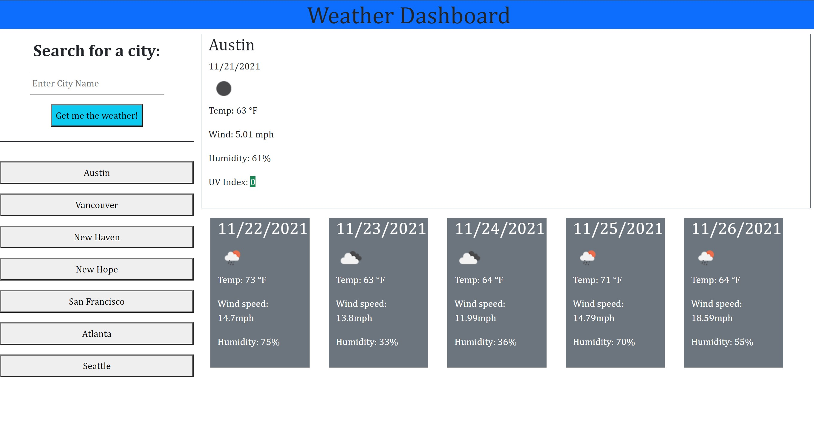

## Shaun's Weather Forecast App

## About
This is a straightforward weather app that uses third-party API calls to return the current weather and a forecast. City searches are also saved to localstorage so users can recall their recently searched cities. 

## Purpose
To build a weather app that uses third-party API Endpoints to generate information. To practice API calls and using localstorage. 

## Built With
* HTML
* CSS
* Javascript
* Bootstrap

## Live Application Link
https://mnshaun24.github.io/weather-for-you/

## Screenshot

## Contribution
Shaun Sticka

